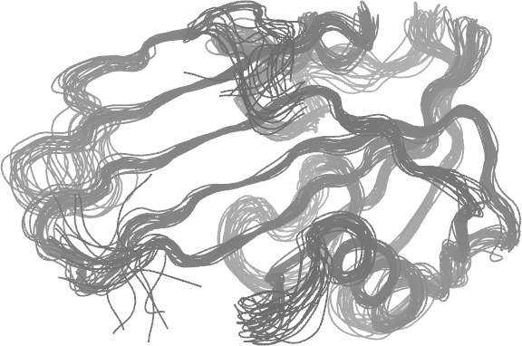

# msfit and mmfit

This repository contains code and associated data for the structural superposition and variance-covariance estimation of protein conformations, as presented in the paper titled "Multilevel Superposition for Deciphering the Conformational Variability of Protein Ensembles".

The codes on this page have been tested
on Debian bookworm-sid/gcc 12.2.0/R 4.2.1
and
on macOS 13.6/clang 15.0.0/R 4.1.2.


# Preparation (installation)

`MXDIR` refers to the top directory of the repository.
```bash
MXDIR=path/to/somewhere
```
Go to the src directory, and make.
```
cd $MXDIR/src
make
```

In the subsequent code examples, datasets in the directory `$MXDIR/data/` are used.
In these examples, it is assumed that the code is executed in a separate directory `$MXDIR/tests/` rather than `$MXDIR/data/` to keep `$MXDIR/data/` clean.

# Example Usage

## markpdb

`markpdb` attaches labels to atoms to use in superposition.
Each structure should be defined as a chain with the same "chainID" in a PDB file.
Chains should be delimited by `TER` or enclosed within `MODEL...ENDMDL`.
The label is determined based on the Atom and resSeq of each ATOM record (line).


To label CA atoms in a file `in.pdb` to produce a file `out.pdbm`:
```
markpdb "CA" in.pdb > out.pdbm
```

To label backbone atoms in a file `in.pdb` to produce a file `out.pdbm`:
```
markpdb "N;CA;C;O" in.pdb > out.pdbm
```

Specific examples are given below.

## msfit

`msfit` performs superposition of multiple conformations while considering the degrees of fluctuation of atoms.

The following commands demonstrate superimposing structures found in the `hmth1a.pdb` file.
The `-v d` option specifies the use of a diagonal working covariance matrix, which is recommended.
The resulting superimposed structures and the estimated sample covariance matrix are written to `fitted.pdb` and `cov.txt`, respectively.
```bash
cd $MXDIR/tests/
tar Jxf $MXDIR/data/single.tar.xz && cd single/
  ## label backbone atoms for superposition
$MXDIR/src/markpdb "N;CA;C;O" hmth1a.pdb > hmth1a.pdbm
$MXDIR/src/msfit -v d -o c fitted.pdb -o s cov.txt hmth1a.pdbm
```
{}

Limitations:

 - The current code requires complete-case datasets,
   meaning that all marker atoms must be presented in every structure.
 - The sample covariance matrix is that for isotropic displacements.
   The anisotropic covariance matrix is only obtainable only in a binary format.
   See [Anisotropic variances and binary output](#anisotropic-variances-and-binary-output).
   

## mmfit

`mmfit` performs superposition of the multiple conformations from multiple ensembles, accounting for variability between the ensembles.

In the following sequence of commands, `mmfit` performs multilevel superposition on ensembles from `crd0000.pdbm` to `crd0019.pdbm`, with each ensembles contains five conformations.
```bash
cd $MXDIR/tests/
tar Jxf $MXDIR/data/multi.tar.xz && cd multi/
  ## label CA atoms for superposition
for f in $(ls crd*.pdb); do
    $MXDIR/src/markpdb "CA" $f > ${f}m
done
$MXDIR/src/mmfit -d -v -c -r 0 -e 5e-8 -n 5000 crd*.pdbm | tee mmfit.log
```

The meanings of the options provided for `mmfit` are as follows:

 - `-d`: Use a diagonal working covariance matrix (recommended).
 - `-v`: Write the estimated isotropic covariance matrices (V & S) to the file `vsvs.dat`.
 - `-c`: Write the estimated mean (M) and the superimposed individual structures (Yij) to `m.pdb` and `crd.pdb`, respectively.
 - `-r 0`: Use maximum likelihood (ML) instead of REML.
 - `-e 5e-8`: Set the relative tolerance for stopping criteria.
 - `-n 5000`: Specify the upper limit for the number of EM iterations.


# Anisotropic variances and binary output

## `msfit`

To calculate the anisotropic covariance matrix using the [previously created file `hmth1a.pdbm`](#msfit), execute the following commands:
```
cd $MXDIR/tests/single
$MXDIR/src/msfit -v d -o c fitted.pdb -o s cov.txt -b o out.bin hmth1a.pdbm
```

By adding the option `-b o out.bin` to `msfit`, two binary files, `iout.bin` and `dout.bin` are generated.
The following R script illustrates the format of the two binary files.
The script extracts the estimated mean structure $M$, the superimposed structures $\{Y_{ij}\}$, and the anisotropic covariance matrix $\Sigma$ from `dout.bin`.
```R
con <- file('iout.bin', 'rb')
a <- readBin(con, 'int', 2)
close(con)
  ## the number of the marker atoms
natoms <- a[1]
  ## the total number of the structures
nconfms <- a[2]
con <- file("dout.bin", 'rb')
  ## isotropic covariance matrix
isoS <- readBin(con, 'double', natoms^2)
  ## mean structure
M <- readBin(con, 'double', natoms*3)
  ## superimposed structures
Y <- array(readBin(con, 'double', natoms*3*nconfms), c(natoms*3,nconfms))
  ## anisotropic covariance matrix
anisoS <- matrix(readBin(con, 'double', (natoms*3)^2), ncol=natoms*3)
close(con)
```

## `mmfit`

The calculation of anisotropic covariance matrices for multi-ensemble data proceeds in two steps.
An example is provided for the previously used dataset `crd0000.pdbm`--`crd0019.pdbm`.
```
cd $MXDIR/tests/multi
$MXDIR/src/mmfit -d -v -c -r 0 -e 5e-8 -n 5000 -b o out.bin crd*.pdbm | tee mmfit.log
$MXDIR/src/anisovar -d -n 1 iout.bin dout.bin vsout.bin | tee anisovar.log
```

In this example, by including the option '-b o out.bin' with `mmfit`, two binary files, `iout.bin` and `dout.bin` are created.
Subsequently, `anisovar` reads these two files and computes two anisotropic covariance matrices, $W$ and $\Sigma$, which are stored in `vsout.bin`.
The options "`-d -n 1`" must be specified as in this example.
The following R code demonstrates how to extract data from the three binary files.
```R
con <- file('iout.bin', 'rb')
  ## the number of the marker atoms
natoms <- readBin(con, 'int', 1)
  ## the number of the ensembles ($=\nu$)
nens <- readBin(con, 'int', 1)
  ## array of the ensemble sizes, i.e., m_1, m_2, ..., m_nu
mis <- readBin(con, 'int', nens)
close(con)
con <- file("dout.bin", 'rb')
  ## mean
M <- readBin(con, 'double', natoms*3)
  ## superimposed Yij
Y <- array(readBin(con, 'double', natoms*3*sum(mis)), c(natoms*3,sum(mis)))
close(con)
con <- file('vsout.bin', 'rb')
  ## anisotropic inter-ensemble covariance matrix
anisoW <- matrix(readBin(con, 'double', (natoms*3)^2), ncol=natoms*3)
  ## anisotropic intra-ensemble covariance matrix
anisoSigma <- matrix(readBin(con, 'double', (natoms*3)^2), ncol=natoms*3)
close(con)
```


## `tsfitca.sh`

`tsfitca.sh` is a simple implementation of the two-stage method (TS) specifically designed for use in the study.
This bash script takes as an argument the name of a file that contains the names of CA-marked pdbm files.
Each pdbm file contains structures of ensemble members.
```bash
mkdir $MXDIR/tests/ts && cd "$_"
tar Jxf $MXDIR/data/multi.tar.xz && cd multi
ls
for f in $(ls *.pdb); do $MXDIR/src/markpdb "CA" $f > ${f}m; done
ls "$PWD"/*.pdbm > pdbmfiles.txt
ls
$MXDIR/src/tsfitca.sh pdbmfiles.txt
  ## rotate Mi and Yij according to the second stage rotation Ri,
  ## in the current directory
$MXDIR/src/tsfitcayrot.sh
```
The following R code illustrates how to extract data from the binary files generated in that directory.
```R
con <- file('its.bin','rb')
  ## the number of the marker atoms
natoms <- readBin(con,'int')
  ## the number of the ensembles ($=\nu$)
nens <- readBin(con,'int')
  ## array of the ensemble sizes, i.e., m_1, m_2, ..., m_nu
mis <- readBin(con, 'int', nens)
close(con)
con <- file('dts.bin', 'rb')
seek(con, 8*natoms^2)
  ## mean
M <- readBin(con, 'double', natoms*3)
  ## ensemble deviations, Z_1, Z_2, ..., Z_{\nu}.
Z <- array(readBin(con, 'double', natoms*3*nens), c(natoms*3,nens))
close(con)

con <- file('yrot.bin', 'rb')
  ## Mi's and Yij's
MY <- array(readBin(con, 'double', natoms*3*sum(mis+1)), c(natoms*3,sum(mis+1)))
close(con)
  ## remove Mi's (ensemble mean structures) yeilding {Yij}
Y <- MY[,-c(1,cumsum(mis+1)[1:(nens-1)]+1)]

con <- file('tsV9.bin', 'rb')
  ## anisotropic inter-ensemble covariance matrix
anisoW <- matrix(readBin(con, 'double', (natoms*3)^2), ncol=natoms*3)
close(con)
con <- file('tsS9.bin', 'rb')
  ## anisotropic intra-ensemble covariance matrix
anisoSigma <- matrix(readBin(con, 'double', (natoms*3)^2), ncol=natoms*3)
close(con)
```


# Applications to X-ray structures

## Class A $\beta$-lactamases

Data

 - $MXDIR/data/abl.tar.xz: PDB files used in the study of the paper
 - $MXDIR/data/resid-abl.txt: aligned sequences and residue numbering

A sample code for estimating covariance matrices

```bash
cd $MXDIR/tests/
tar Jxf $MXDIR/data/abl.tar.xz && cd abl/
  ## Each conformation is now extracted into `./perchain/`
  ## with a filename of enzymename-PDBIDchainID.pdb.
  ## `gather.sh` collects conformations for each enzyme to constitute an ensemble.
$MXDIR/scripts/gather.sh ./perchain
  ## create pdbm files by marking CA atoms in the pdb files.
for f in $(ls *.pdb); do $MXDIR/src/markpdb "CA" ${f} > ${f}m; done
  ## list of the pdbm files for individual enzymes
ls "$PWD"/*.pdbm | grep -v pooled.pdbm > pdbmfiles.txt
  ## REM estimation
mkdir $MXDIR/tests/abl/REM && cd "$_"
  ## the list of pdbm files are read from `../pdbmfiles.txt`
$MXDIR/src/mmfit -d -r 0 -n 50000 -e 1e-5  -v -c -b o out.bin -i ../pdbmfiles.txt | tee mmfit.log
$MXDIR/src/anisovar -d -n 1 -e 1.0e-5 iout.bin dout.bin vsout.bin  | tee anisovar.log
  ## TS estimation
mkdir $MXDIR/tests/abl/TS && cd "$_"
$MXDIR/src/tsfitca.sh ../pdbmfiles.txt
$MXDIR/src/tsfitcayrot.sh
  ## IWLS estimation on the pooled ensemble (the traditional method) 
mkdir $MXDIR/tests/abl/SPE && cd "$_"
$MXDIR/src/msfit -v d -o c _tmp1 -o s spe-cov.dat -b o out.bin ../pooled.pdbm | tee msfit.log
```


## Cytochrome P450 family 2 (CYP2)

Data
 
 - $MXDIR/data/cyp2.tar.xz: PDB files used in the study of the paper
 - $MXDIR/data/resid-cyp2.txt: aligned sequences and residue numbering
 
A sample code for estimating covariance matrices.
```bash
cd $MXDIR/tests/
tar Jxf $MXDIR/data/cyp2.tar.xz && cd cyp2/
  ## Each conformation is stored under $MXDIR/data/cyp2/perchain
  ## with a filename of enzymename-PDBIDchainID.pdb.
  ## `gather.sh` collects conformations for each enzyme to constitute an ensemble.
$MXDIR/scripts/gather.sh ./perchain
  ## create pdbm files by marking CA atoms in the pdb files.
for f in $(ls *.pdb); do $MXDIR/src/markpdb "CA" ${f} > ${f}m; done
  ## list of the pdbm files for individual enzymes
ls "$PWD"/2*.pdbm > pdbmfiles.txt
  ## REM estimation
mkdir $MXDIR/tests/cyp2/REM && cd "$_"
  ## the list of pdbm files are read from `../pdbmfiles.txt`
$MXDIR/src/mmfit -d -r 0 -n 50000 -e 1e-5  -v -c -b o out.bin -i ../pdbmfiles.txt | tee mmfit.log
$MXDIR/src/anisovar -d -n 1 -e 1.0e-5 iout.bin dout.bin vsout.bin  | tee anisovar.log
  ## TS estimation
mkdir $MXDIR/tests/cyp2/TS && cd "$_"
$MXDIR/src/tsfitca.sh ../pdbmfiles.txt
$MXDIR/src/tsfitcayrot.sh
  ## IWLS estimation on the pooled ensemble (the traditional method) 
mkdir $MXDIR/tests/cyp2/SPE && cd "$_"
$MXDIR/src/msfit -v d -o c _tmp1 -o s spe-cov.dat -b o out.bin ../pooled.pdbm | tee msfit.log
```


# Principal Component Analysis (PCA)

As an example of PCA using the estimated covariance matrices,
the following code will produce a plot 
correspoinding Figure 6(a) in the paper.

To proceed, cd to `$MXDIR/tests/abl/REM`, and then execute the following R code.

```
con <- file('iout.bin', 'rb')
natoms <- readBin(con, 'int', 1)
  ## nens == nu
nens <- readBin(con, 'int', 1)
  ## array of the ensemble sizes, i.e., m_1, m_2, ..., m_nu
mis <- readBin(con, 'int', nens)
close(con)
con <- file("dout.bin", 'rb')
  ## mean
M <- readBin(con, 'double', natoms*3)
  ## superimposed Yij
Y <- array(readBin(con, 'double', natoms*3*sum(mis)), c(natoms*3,sum(mis)))
close(con)
con <- file('vsout.bin', 'rb')
  ## anisotropic inter-ensemble covariance matrix W
anisoW <- matrix(readBin(con, 'double', (natoms*3)^2), ncol=natoms*3)
close(con)
  ## Dij = Yij - M
d <- sweep(Y, 1, M)
  ## eigen decomposition of W
eig <- eigen(anisoW)
evec <- eig$vector
prj <- t(d) %*% evec[,1:2]
df <- as.data.frame(prj)
colnames(df) <- c("PC1","PC2")
df$GroupID <- factor(read.table("../clustmap.txt", header=T)[,2] + 1)

library(ggplot2)
p <- ggplot(df, aes(x=PC1,y=PC2)) + geom_point(aes(shape=GroupID,colour=GroupID), size=2) + scale_shape_manual(values=factor(1:nens)) + scale_colour_manual(values=factor(1:nens))
ggsave("ablWpc12.png", p)
```


# Data and Primary Software Code Used in the Paper

Primary software (in the `src/` directory):

 - `mmfit`, `msfit`, `markpdb`
 - `tsfitca`, `tsfitcayrot`, 
 - `genconfms`: a program that gererates random conformations

Data (in the `data/` directory):

 - `numtests.tar.xz`
 - `abl.tar.xz`
 - `cyp2.tar.xz`
 - `cam.tar.xz` & grouping-cam.txt (a calmodulin example)

Raw Bash/R scripts (in the `scripts/` directory)

 - `papers.tar.xz`

Each tar.xz file should be expanded to the directory where it resides.
The file `fixpath.sh` in the `script` directory is a script to fix paths in the files in `papers.tar.xz`.
After expanding the tar.xz file, invoke as:
```
MXDIR=$MXDIR $MXDIR/fixpaths.sh
```
Then the modified scripts should run on the tree under $MXDIR.
All calculations were carried out on Debian in this study.


# Citing
